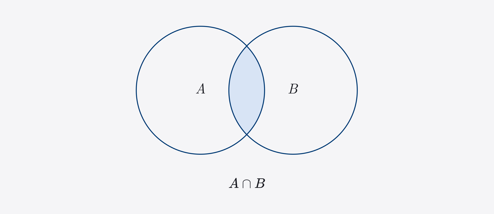
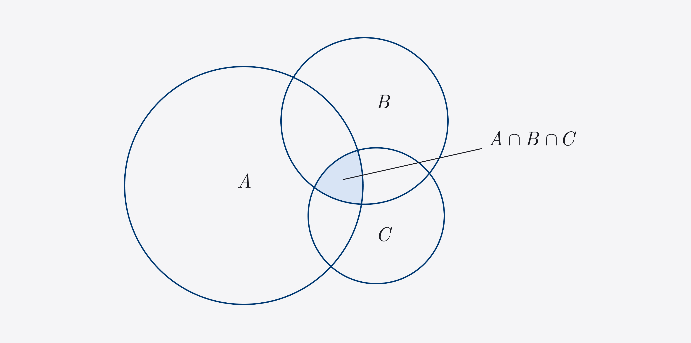
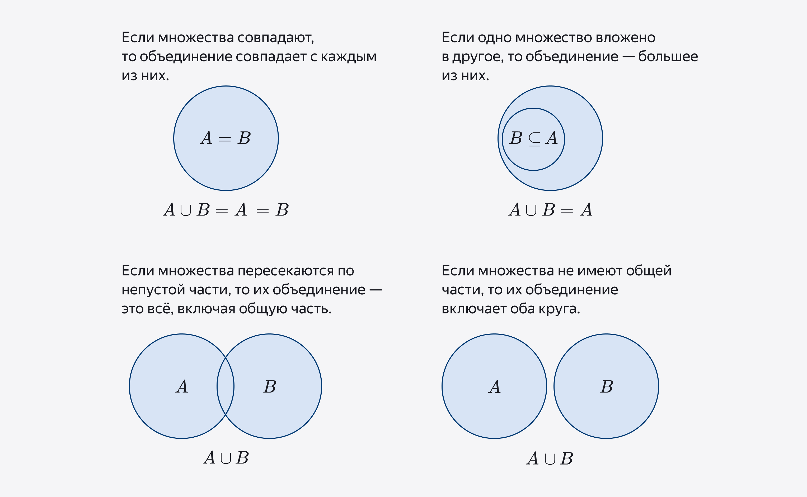
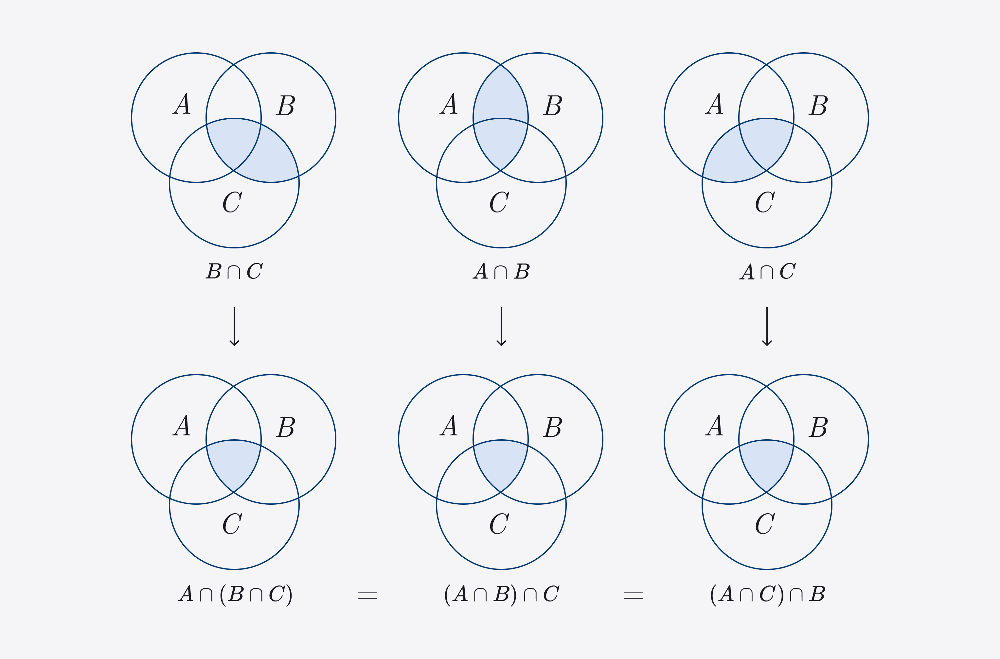

## Intersection of a set - Пересечение множества

Пересечение $A \cap B$ двух множеств $A$ и $B$ состоит из элементов, которые принадлежат обоим исходным множествам. То есть в пересечение попадут лишь те элементы, которые есть и в $A$ и в $B$ ***одновременно***.  

Пересечение двух множеств также является множеством. Если нет элементов которые принадлежат двум множествам сразу, тогда пересечение множеств будет пустым: $A \cap B = \varnothing$

Эти круги называются диаграммы Эйлера. 

пересечению $A \cap B \cap C$ принадлежат только те элементы, которые содержатся в трех множествах одновременно.  

## Union - Объединение

Объединение $A \cup B$ состоит из всех элементов исходных множеств $A$ и $B$ вместе. Например если $A = \{100,200,300,400,500\}, B = \{100,500,1000,1500\}$, то
$A \cup B = \{100, 200, 300, 400, 500, 1000, 1500\}$  

## Properties intersection and union of sets. Свойства пересечения и объединения множеств.

### **Свойство коммутативности**

Вне зависимости от порядка множеств элементы их пересечение и объединения неизменны.  
$A \cup B = B \cup A$  
$A \cap B = B \cap A$
Очень похоже на коммутативность сложения и умножения:
$a * b = b *a; \ a + b = b + a$

## **Свойство ассоциативности**

Если множеств три, то можно найти пересечение от них из двух, а потом добавить третье. C каких двух множеств начинать не имеет значения.  

Аналогично с объединением.  
$A \cap (B \cap C) = B \cap (A \cap C) = C \cap (A \cap B)$  
$A \cup (B \cup C) = B \cup (A \cup C) = C \cup (A \cup B)$

## Свойство пересечение и объединение для пустого множества.

При пересечении множества с пустым, получается пустое множество, при объединении получается исходное множество.  
$A \cap \varnothing = \varnothing$
$A \cup \varnothing = A$

## Дистрибутивность пересечения относительно объединения

Чтобы пересечь $A$ с объединением $B \cup C$, можно пересечь $A \cap B$ и $A \cap C$, а потом найти объединения получившихся множеств:  
$A \cap (B \cup C) = (A \cap B) \cup (A \cap C)$

Дистрибутивность объединения относительно пересечения:
$A \cup (B \cap C) = (A \cup B) \cap (A \cup C)$
